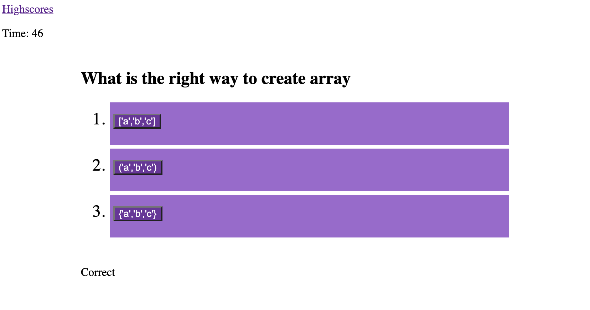
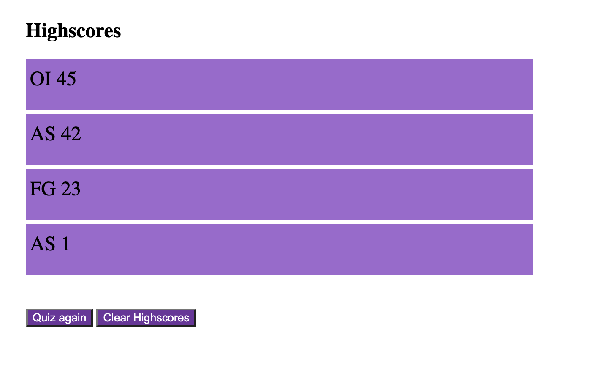

# javascript_quiz_hw4
Javascript quiz with highscores and timer.


### How  it look?





### Where it deployed?

[Javascript quiz]( https://myau5x.github.io/javascript_quiz_hw4/)


### How it work?

```
GIVEN I am taking a code quiz
WHEN I click the start button
THEN a timer starts and I am presented with a question
WHEN I answer a question
THEN I am presented with another question
WHEN I answer a question incorrectly
THEN time is subtracted from the clock
WHEN all questions are answered or the timer reaches 0
THEN the game is over
WHEN the game is over
THEN I can save my initials and score
THEN I see a highscore table
```

### Files
- `index.html` &ndash; quiz html page
- `highscores.html` &ndash highscores html page
- `ctyle.css` &ndash; styles for html
- `script.js` &ndash; script that works with quiz
- `script2.js` &ndash; script that show sorted highscores

### Licence
[MIT License](https://github.com/Myau5x/javascript_quiz_hw4/blob/master/LICENSE)
